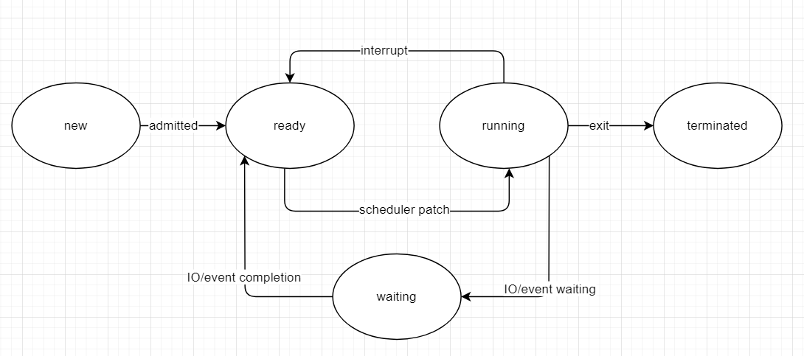
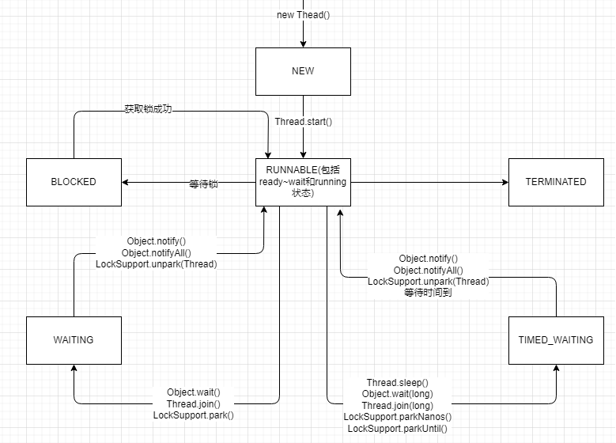

# 4 Java线程的状态及主要转化方法
## 4.1 操作系统中的线程状态转换

主要三个状态:
- ready: 等待调度
- running: 执行中
- waiting: 等待IO或其他资源
## 4.2 Java线程的6个状态
```java
public enum State {
    NEW,
    RUNNABLE,
    BLOCKED,
    WAITING,
    TIMED_WAITING,
    TERMINATED;
}
```
### 4.2.1 NEW
NEW:
线程已经创建,但未调用start()方法
start():
start只能在NEW状态下调用一次,其他调用会报错
### 4.2.2 RUNNABLE
RUNNABLE:
对应操作系统的ready~waiting和running状态,可能等待执行,也可能正在执行
### 4.2.3 BLOCKED
BLOCKED:
等待锁释放,进入同步区代码
### 4.2.4 WAITING
WAITING:
- 等待状态,进入RUNNABLE需要其他线程唤醒
- 三种方法进入等待状态:
  1. Object.wait(): 等待其他线程notify()唤醒
  2. Thread.join(): 等待其他线程执行完毕
  3. LockSupport.park(): 等待调用许可

### 4.2.5 TIMED_WAITING
TIMED_WAITING: 
- 超时等待状态, 时间到了自动唤醒
- 进入超时等待状态的的方法:
  1. Thread.sleep(long): 当前线程睡眠指定时间
  2. Object.wait(long): 线程休眠指定时间,可以用notify()/notifyAll()唤醒
  3. Thread.join(long): 等待当前线程执行一定时间后唤醒
  4. LockSupport.parkNanos(long): 等待调用许可指定时间
  5. LockSupport.parkUntil(long): 等待调用许可指定时间
### 4.2.6 TERMINATED
TERMINATED: 线程执行完毕
## 4.3 线程状态的转换

### 4.3.1 BLOCKED与RUNNABLE状态的转换
### 4.3.2 WAITING与RUNNABLE状态的转换
### 4.3.3 TIMED_WAITING与RUNNABLE状态的转换
### 4.3.4 线程中断
只可以设置线程中断状态为true,具体中断与否线程自行处理
- Thread.interrupt(): 设置状态为中断线程
- Thread.interrupted(): 切换中断状态并返回
- Thread.isInterrupted(): 返回中断状态